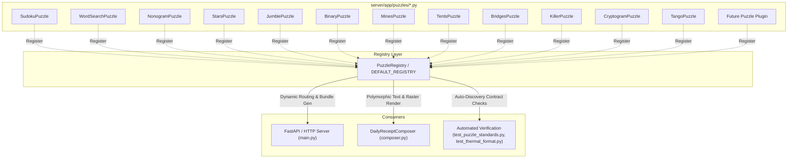

# Morning Puzzles: Puzzle Plugin Architecture & Contributor Guide

This document defines the unified **Puzzle Plugin System** for Morning Puzzles. It explains how games are encapsulated, registered, validated, and rendered to commercial 80mm ESC/POS thermal receipt printers.

---

## 1. Architectural Overview

### The Legacy Problem
Previously, adding or modifying a puzzle required synchronizing changes across four decoupled, monolithic files:
1. Custom procedural generator scripts (`server/app/generators/*.py`).
2. An 816-line procedural switchboard in `server/app/renderer/text_formatter.py`.
3. A 1,404-line rasterizer file in `server/app/renderer/receipt_rasterizer.py`.
4. A 12-branch manual route/bundle dispatcher in `server/app/main.py`.

This created high coupling, code duplication, fragile maintenance, and high barrier to entry for human contributors and AI agents.

### The Unified Plugin Solution
Under the plugin architecture, **every game is a self-contained plugin** implementing a single abstract base class (`BasePuzzle`). The web server, receipt composer, and test suites are 100% data-driven and polymorphic.



---

## 2. Core Contracts

All interfaces live in `server/app/puzzles/base.py`.

### A. `BasePuzzle` (Abstract Base Class)
Every puzzle inherits from `BasePuzzle` and implements:

| Member | Type | Description |
|---|---|---|
| `puzzle_id` | `property -> str` | Unique lowercase identifier (e.g. `'sudoku'`, `'mines'`). Used in API routes and bundle keys. |
| `title` | `property -> str` | Strict one-word uppercase title (e.g. `'SUDOKU'`, `'MINES'`). |
| `has_difficulty` | `property -> bool` | `True` for difficulty-driven puzzles, `False` for theme-driven (e.g. `SEARCH`). Defaults to `True`. |
| `supported_difficulties` | `property -> List[str]` | List of supported tiers (e.g. `['easy', 'medium', 'hard', 'extreme']`). |
| `generate(difficulty, **kwargs)` | `method -> BasePuzzleResult` | Generates a puzzle instance. Must return a `BasePuzzleResult`. |
| `get_instruction(puzzle_data)` | `method -> str` | Canonical $\le 100$-character instruction line matching Section 3 standards. |
| `format_ascii_puzzle(puzzle_data)` | `method -> str` | Monospaced ASCII representation of the unsolved puzzle for pure-text receipts. |
| `format_solution_key(puzzle_data)` | `method -> List[str]` | Monospaced lines for the solution key. 2D grids pre-indented by 6 spaces (`'      '`). |
| `render_raster(puzzle_data, target_width=576)` | `method -> bytes` | Renders ESC/POS GS v 0 1-bit raster graphic (576 dots width). |

### B. `BasePuzzleResult` (Envelope)
Dataclass and dict-like mapping hybrid:
- Provides typed properties: `puzzle_type`, `title`, `difficulty`, `instruction`.
- Implements `collections.abc.Mapping` and `.to_dict()` for 100% transparent backwards compatibility with legacy code and `json.dumps()`.

### C. `ThermalCanvas` (Shared Drawing Primitives)
Located in `server/app/renderer/canvas.py`. Provides high-contrast, thermal-optimized 1-bit graphics primitives:
- `draw_grid(grid, left, top, cell_w, cell_h, border_w, ...)`: Clean grid lines.
- `draw_rect(...)`, `draw_circle(...)`, `draw_line(...)`: Geometric shapes.
- `draw_text(text, x, y, size, ...)` & `draw_centered_text(...)`: Proportional or bitmap font rendering.
- `draw_stars(cx, cy, radius, ...)`: Star icons for Star Battle / Queens.
- `to_escpos_raster()`: Generates hardware-ready ESC/POS GS v 0 binary payloads with 8-dot height alignment.
- Dual Backend: Uses Pillow when installed; automatically falls back to pure-Python `ThermalBitmap` without external dependencies.
- Built-in `calculate_duty_cycle()` ensures safe thermal print head operation ($\le 35\%$ average black pixels).

---

## 3. Step-by-Step Tutorial: Adding a New Puzzle (e.g., KAKURO)

Adding a new puzzle requires **zero modifications to `main.py` or existing renderers**. Follow these 4 steps:

### Step 1: Create the Plugin Class
Create `server/app/puzzles/kakuro.py`:

```python
from typing import Dict, Any, List, Union
from app.puzzles.base import BasePuzzle, BasePuzzleResult
from app.renderer.canvas import ThermalCanvas

class KakuroPuzzle(BasePuzzle):
    @property
    def puzzle_id(self) -> str:
        return "kakuro"

    @property
    def title(self) -> str:
        return "KAKURO"

    def generate(self, difficulty: str = "medium", **kwargs) -> BasePuzzleResult:
        # 1. Run your procedural generator
        grid, clues, solution = self._generate_kakuro_board(difficulty)
        
        raw_data = {
            "difficulty": difficulty,
            "grid": grid,
            "clues": clues,
            "solution": solution,
        }
        
        # 2. Return BasePuzzleResult
        return BasePuzzleResult(
            puzzle_type=self.puzzle_id,
            title=self.title,
            difficulty=difficulty,
            instruction=self.get_instruction(raw_data),
            raw_data=raw_data,
        )

    def get_instruction(self, puzzle_data: Union[BasePuzzleResult, Dict[str, Any]]) -> str:
        # Must follow canonical formula: <= 100 chars, approved imperative verb, zero jargon
        return "Fill white cells with digits 1-9 so each run adds up to the clue above or to the left."

    def format_ascii_puzzle(self, puzzle_data: Union[BasePuzzleResult, Dict[str, Any]]) -> str:
        # Return monospaced ASCII board
        return "      ┌─────┬─────┐\n      │ \\ 4 │  .  │\n      └─────┴─────┘"

    def format_solution_key(self, puzzle_data: Union[BasePuzzleResult, Dict[str, Any]]) -> List[str]:
        # Return solution key lines (6-space pre-indented for grids)
        return [
            "      ┌─────┬─────┐",
            "      │ \\ 4 │  4  │",
            "      └─────┴─────┘",
        ]

    def render_raster(self, puzzle_data: Union[BasePuzzleResult, Dict[str, Any]], target_width: int = 576) -> bytes:
        # Use ThermalCanvas primitives
        canvas = ThermalCanvas(width=target_width, height=576)
        # Draw clues, cell dividers, numbers...
        return canvas.to_escpos_raster()

    def _generate_kakuro_board(self, difficulty: str):
        # Implementation details...
        return [], {}, []
```

### Step 2: Register in `DEFAULT_REGISTRY`
In `server/app/puzzles/registry.py`:

```python
from app.puzzles.kakuro import KakuroPuzzle

# In create_default_registry():
registry.register(KakuroPuzzle())
```

### Step 3: Export in `server/app/puzzles/__init__.py`
```python
from app.puzzles.kakuro import KakuroPuzzle
```

### Step 4: Run Verification
```bash
python3 server/test_puzzle_standards.py
python3 server/test_thermal_format.py
```
Both test suites will automatically discover Kakuro, verify its headers, instruction length, solution formatting, duty cycle, and thermal raster output!

---

## 4. Architectural Invariants (Non-Negotiable Rules)

1. **No Procedural Routing**: Never add `elif puzzle_id == "kakuro"` in `main.py`. The dynamic router `@app.get("/api/v1/puzzles/{puzzle_id}")` and `DEFAULT_REGISTRY.get(puzzle_id)` handle all endpoints automatically.
2. **One-Word Title**: Title must be strictly one uppercase English word (e.g. `--- KAKURO ---`).
3. **$\le 100$-Character Description**: Instruction string must start with an approved imperative verb, be exactly one sentence, contain zero jargon, and not exceed 100 characters under any configuration.
4. **Thermal Safety ($\le 35\%$)**: Raster graphics must never saturate the receipt with solid black blocks. Always verify duty cycle with `calculate_duty_cycle()`.
5. **Indentation**: 2D grid solutions must always be pre-indented by 6 spaces (`'      '`).
